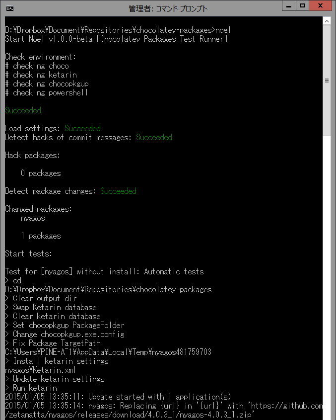

Noel
--------
[](https://drone.io/github.com/pine613/noel/latest)


Noel is not a Blu-ray disc. Noel is a test runner of chocolatey packages!

## Description
Noel is a test runner for Chocolatey repository. Noel supports both packages of manual and automatic. It uses Ketarin as backend if builds automatic packages. Noel runs on CI.

## Screenshot



## Usage
### Create settings
noel.json
```json
{
    "manual": ["manual", "package", "name"],
    "automatic": ["automatic", "package", "name"]
}
```

### Run
```
$ go get github.com/pine613/noel

$ cd your_chocolatey_repo
$ noel
```

## How to test non-changed packages
Please include `[pkg-name]` to commit message. If you want to test all packages, please try `[<all>]` meta name.